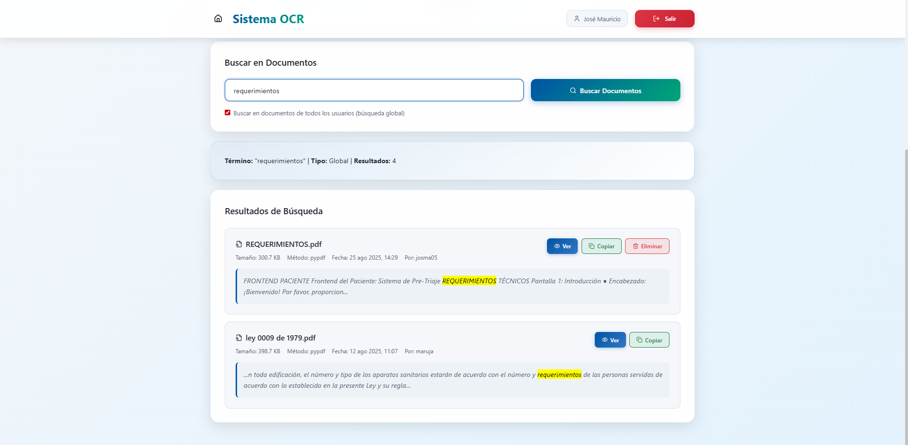

# OCR Document Processing Platform

A comprehensive web-based solution for intelligent document processing and text extraction from PDF files. This platform combines advanced OCR (Optical Character Recognition) technology with modern web development frameworks to provide seamless document management, text extraction, and search capabilities for both scanned and digital PDF documents.

## Features

### Core Functionality
- **Advanced OCR Processing**: Extract text from both scanned images and digital PDF documents
- **Intelligent Document Search**: Full-text search capabilities with document indexing
- **User Authentication System**: Secure user registration and authentication
- **Document Management**: Upload, process, and organize PDF documents efficiently
- **Real-time Processing**: Asynchronous document processing with status tracking
- **RESTful API**: Complete API for integration with external systems

### User Interface
- **Modern React Frontend**: Responsive and intuitive user interface
- **Document Upload Interface**: Drag-and-drop file upload with validation
- **Search Dashboard**: Advanced search functionality with filtering options
- **Document Viewer**: Integrated PDF viewer with extracted text overlay
- **User Management**: Registration, login, and profile management

## Architecture

The system follows a modern full-stack architecture:

- **Backend**: Django + Django REST Framework
- **Frontend**: React with modern JavaScript (ES6+)
- **Database**: SQLite (development) / PostgreSQL (production ready)
- **OCR Engine**: Tesseract OCR with Poppler for PDF processing
- **File Processing**: Asynchronous document processing pipeline

## Screenshots

### Authentication System

*Secure user authentication interface*


*User registration with validation*

### Dashboard

*Main dashboard with document management overview*

### Document Processing

*OCR text extraction process*


*Extracted text visualization*

### Document Search

*Document search interface*


*Search results with document indexing*


*Detailed document view modal*

## Prerequisites

### System Requirements
- **Python**: 3.10 or higher
- **Node.js**: 18.0 or higher
- **npm**: 8.0 or higher (or yarn as alternative)
- **Git**: Latest version

### External Dependencies
The system requires the following external tools for OCR processing:

#### Windows
- **Tesseract OCR**: Download from [GitHub releases](https://github.com/UB-Mannheim/tesseract/wiki)
- **Poppler**: Download from [Poppler for Windows](https://github.com/oschwartz10612/poppler-windows)

#### macOS
```bash
brew install tesseract poppler
```

#### Ubuntu/Debian
```bash
sudo apt-get update
sudo apt-get install tesseract-ocr poppler-utils
```

## Installation & Setup

### 1. Clone the Repository
```bash
git clone https://github.com/junda05/OCR.git
cd OCR
```

### 2. Backend Setup

#### Install Python Dependencies
```bash
cd Backend
pip install pipenv
pipenv install
pipenv shell
```

#### Configure OCR Tools
Create a `.env` file in the `Backend` directory or update `settings.py` with the correct paths:

```python
# Windows Example
POPPLER_PATH = r'C:\Users\YourUser\AppData\Local\Microsoft\WinGet\Packages\oschwartz10612.Poppler_Microsoft.Winget.Source_8wekyb3d8bbwe\poppler-24.08.0\Library\bin'
TESSERACT_CMD = r'C:\Program Files\Tesseract-OCR\tesseract.exe'

# macOS/Linux Example (if installed via package manager)
POPPLER_PATH = '/usr/local/bin'  # or '/opt/homebrew/bin' for M1 Macs
TESSERACT_CMD = '/usr/local/bin/tesseract'  # or '/opt/homebrew/bin/tesseract'
```

#### Database Migration
```bash
python manage.py makemigrations
python manage.py migrate
```

#### Create Admin User (Optional)
```bash
python manage.py createsuperuser
```

#### Start Backend Server
```bash
python manage.py runserver 8001
```
The backend API will be available at `http://localhost:8001/`

### 3. Frontend Setup

```bash
cd ../FrontEnd
npm install
npm start
```
The frontend application will be available at `http://localhost:3000/`

### Frontend Configuration
Update `src/config/axios.js` if your backend runs on a different port:

```javascript
const API_BASE_URL = 'http://localhost:8001/api/v1/';
```

## API Documentation

The system provides a comprehensive RESTful API:

### Authentication Endpoints
- `POST /api/v1/auth/login/` - User authentication (JWT token generation)
- `POST /api/v1/auth/refresh/` - Refresh JWT token
- `POST /api/v1/auth/logout/` - Logout and blacklist token
- `POST /api/v1/crear/` - User registration

### User Management Endpoints
- `GET /api/v1/perfil/` - Get user profile information

### Document Processing Endpoints
- `POST /api/v1/documentos/extraer-texto/` - Upload and extract text from PDF documents
- `GET /api/v1/documentos/` - List user documents
- `GET /api/v1/documentos/{id}/` - Get specific document details
- `GET /api/v1/documentos/global/{id}/` - Get global document details
- `DELETE /api/v1/documentos/{id}/eliminar/` - Delete specific document

### Search and Statistics Endpoints
- `GET /api/v1/documentos/buscar/?q={query}` - Full-text search across documents
- `GET /api/v1/documentos/estadisticas/` - Get document processing statistics

## Testing

### Backend Tests
```bash
cd Backend
python manage.py test
```

### Frontend Tests
```bash
cd FrontEnd
npm test
```

### API Tests
Use the provided test scripts in `Backend/Document_Processing/Tests/`:
```bash
node test_pdf_api.js
```

## Project Structure

```
OCR/
├── Backend/
│   ├── manage.py
│   ├── Backend/              # Django project settings
│   ├── Api/                  # User authentication API
│   ├── Document_Processing/  # Core OCR processing
│   │   ├── Services/        # OCR extraction services
│   │   ├── Tests/           # Unit and integration tests
│   │   └── Utils/           # PDF storage and utilities
│   └── logs/                # Application logs
├── FrontEnd/
│   ├── src/
│   │   ├── components/      # Reusable React components
│   │   ├── pages/          # Main application pages
│   │   ├── services/       # API integration services
│   │   └── context/        # React context providers
│   └── public/             # Static assets
└── images/                 # Documentation screenshots
```

## Troubleshooting

### Common Issues

**OCR not working**: Verify Tesseract and Poppler paths in configuration
**CORS errors**: Check frontend API base URL configuration
**Database errors**: Ensure migrations are applied correctly
**File upload errors**: Check file permissions and storage configuration

### Logs
Application logs are stored in `Backend/logs/`:
- `general.log` - General application logs
- `document_processing.log` - OCR processing specific logs

## Support

For support and questions, please open an issue on the [GitHub repository](https://github.com/junda05/OCR/issues).
